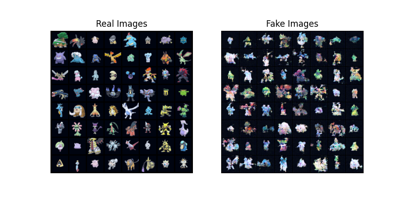

<h1 align="center"> Generative-Pokemon </h1>
<p align="center"> A generative text-to-image model that will take the name and types of a pokemon and return a generated image.
</p>

 - Data source: https://www.kaggle.com/datasets/vishalsubbiah/pokemon-images-and-types
 - Relied on this tutorial: https://pytorch.org/tutorials/beginner/dcgan_faces_tutorial.html 




<h2 align="center"> Model information </h2>
<p>
Simple deep generative adversarial network following PyTorch tutorial. The generator takes a noise vector and uses convolution layers to upsample into an image. The discriminator uses convolution layers to downsample an image into a prediction. Both networks adversarially train to make each better at their respective tasks. Once finished training just use the generator and a noise seed and get a brand new Pokemon amalgum!
</p>

<h3> Image processing </h3>
<p> Images come as 120x120x4 png files in data/images </p>
<p> Transform image by center cropping, reducing size, and normalizing </p>


<p> Model then produces 64x64x3 "fakes" from noise to get new generated pokemon </p>

.png)

<h3> Usage </h3>

```shell
python train.py
```

```shell
python inference.py
```
 - [OPTIONS]
    - --config
    - --random
    - --gen-file
    - --image-name
    - --image-count